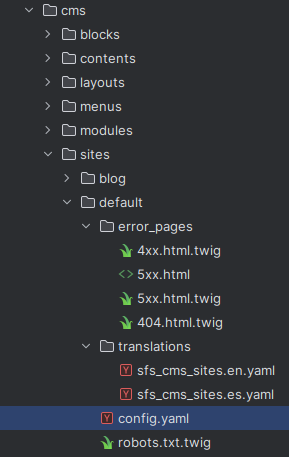

# Multi-Site Setup in CMS

In the CMS, you can configure multiple sites with different settings, languages, and content types. This allows you to manage various websites from a single platform. Let's explore how to configure sites in the CMS:

In this example we have our main website (default) and the blog (blog). You can only have one if you want, of course.

For each site you add a folder in cms/sites/ with the name of the site, and inside you have to create a file called config.yaml with the configuration of the site.

{.img-fluid}

### Let's see a real example ###

```yaml
site:
    allowed_content_types: ['page', 'technology', 'project']
    locales: ['es', 'en']
    default_locale: 'es'
    https_redirect: true
    robots:
        mode: static
        static_file: '@site/default/robots.txt.twig'
    hosts:
        - { domain: '%env(WEB_DOMAIN)%', canonical: true } # , locale: 'es' }
        - { domain: 'www.%env(WEB_DOMAIN)%', redirect_to_canonical: true } # , locale: 'en' }
    paths:
        - { path: '/es/', locale: 'es', trailing_slash_on_root: true }
        - { path: '/en/', locale: 'en', trailing_slash_on_root: true }
    extra:
        order: 1
    error_pages:
        404:
            es: ['@site/default/error_pages/404.html.twig']
            en: ['@site/default/error_pages/404.html.twig']
        4xx:
            es: ['@site/default/error_pages/4xx.html.twig']
            en: ['@site/default/error_pages/4xx.html.twig']
        5xx:
            es: ['@site/default/error_pages/5xx.html.twig', '/srv/cms/site/default/error_pages/5xx-es.html']
            en: ['@site/default/error_pages/5xx.html.twig', '/srv/cms/site/default/error_pages/5xx-en.html']

    slash_route:
        behaviour: 'redirect_to_route_with_user_language'
        route: 'home'
        redirect_code: 301

    sitemaps:
        default:
            url: sitemap.xml
```

And let's go step by step:

>[!IMPORTANT] 
> You don't need to configure all of these, only the ones needed for your site. 
> You can see in the [Install new Symfony Project](getting-started/install-new-symfony-project.md) that you can have a site without any configuration.

### **1️⃣ Allowed Content Types**
```yaml
allowed_content_types: ['page', 'technology', 'project']
```
- Defines which content types are permitted in this site configuration. We explain more about Content Types in the [Content Types](configure-content-types.md) section.
- In this case, the site allows **pages**, **technology articles**, and **projects**.

### **2️⃣ Locales (Languages)**
```yaml
locales: ['es', 'en']
default_locale: 'es'
```
- The site supports **Spanish (es)** and **English (en)**.
- Spanish (`es`) is set as the **default language**.

### **3️⃣ HTTPS Redirection**
```yaml
https_redirect: true
```
- Ensures all traffic is redirected to **HTTPS**.

### **4️⃣ Robots Configuration**
```yaml
robots:
    mode: static
    static_file: '@site/default/robots.txt.twig'
```
- Defines how the `robots.txt` file is handled.
- The mode is **static**, meaning it serves a predefined file.
- The file used is located at `@site/default/robots.txt.twig`.

### **5️⃣ Host Configuration**
```yaml
hosts:
    - { domain: '%env(WEB_DOMAIN)%', canonical: true }
    - { domain: 'www.%env(WEB_DOMAIN)%', redirect_to_canonical: true }
```
- Defines different **domains** where the site is accessible.
- The **canonical** domain is taken from an environment variable (`WEB_DOMAIN`).
- Other domains (like `www.` versions) are redirected to the canonical domain.

### **6️⃣ Path Configuration**
```yaml
paths:
    - { path: '/es/', locale: 'es', trailing_slash_on_root: true }
    - { path: '/en/', locale: 'en', trailing_slash_on_root: true }
```
- Maps URL paths to languages.
- `/es/` → Spanish (`es`)
- `/en/` → English (`en`)
- **trailing_slash_on_root: true** ensures a trailing slash is added.

### **7️⃣ Extra Settings**
```yaml
extra:
    order: 1
```
- Defines an **ordering priority** for the site (useful in multi-site configurations).

### **8️⃣ Error Page Configuration**
```yaml
error_pages:
    404:
        es: ['@site/default/error_pages/404.html.twig']
        en: ['@site/default/error_pages/404.html.twig']
    4xx:
        es: ['@site/default/error_pages/4xx.html.twig']
        en: ['@site/default/error_pages/4xx.html.twig']
    5xx:
        es: ['@site/default/error_pages/5xx.html.twig', '/srv/cms/site/default/error_pages/5xx-es.html']
        en: ['@site/default/error_pages/5xx.html.twig', '/srv/cms/site/default/error_pages/5xx-en.html']
```
- Defines **custom error pages** for different HTTP error codes.
- **404 pages** are language-specific.
- **4xx and 5xx errors** support multiple templates.

### **9️⃣ Slash Route Handling**
```yaml
slash_route:
    behaviour: 'redirect_to_route_with_user_language'
    route: 'home'
    redirect_code: 301
```
- When a user accesses `/`, they are redirected based on their language.
- The route used is `'home'`, and the redirection is a **301 permanent redirect**.

### **🔟 Sitemap Configuration**
```yaml
sitemaps:
    default:
        url: sitemap.xml
```
- Specifies the **sitemap file** used (`sitemap.xml`).

---

This configuration ensures a flexible and scalable multi-site setup!

