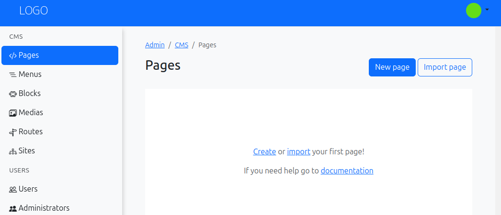
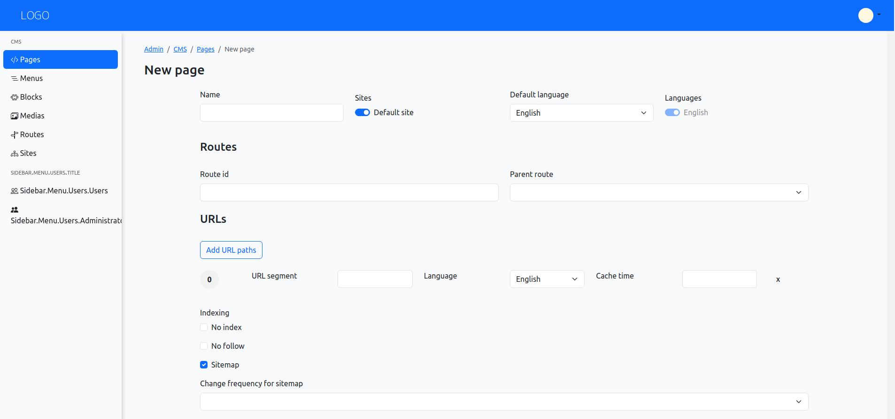
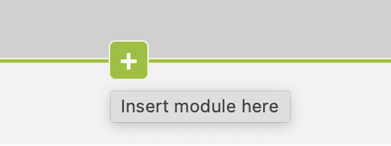
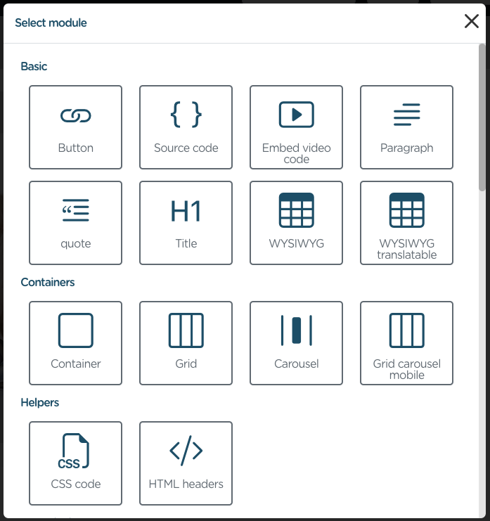
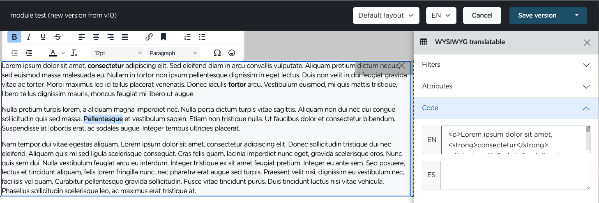
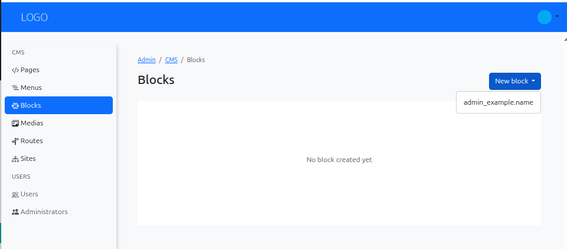
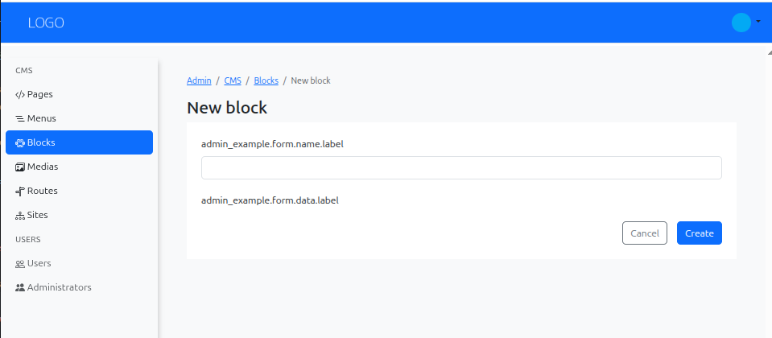
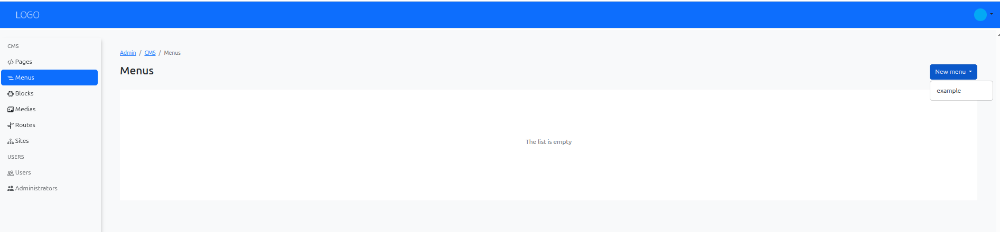
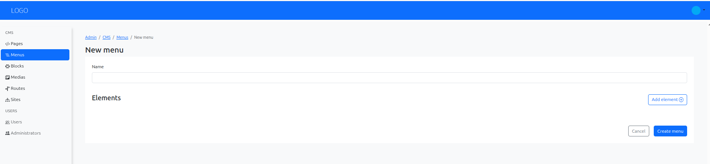
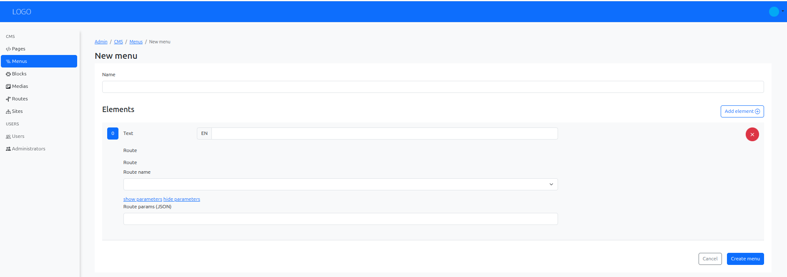

# Build and publish a small website {#build-and-publish-a-small-website}

This example builds a small site for a fictional studio, **Hello Studio**. Visitors will see a home page, an About page, a navigation menu, and the same call to action on both pages. The page text remains editable in the CMS.

Start with an Armonic application that already has a working CMS, a configured site and host, an administrator account, and a running web server. This guide begins after installation. Use the site's existing locale and public URL; the paths below are examples.

Files under `cms/` belong in the Symfony project directory (`kernel.project_dir`). In projects whose Symfony application lives in `app/`, that means `app/cms/`. If your project already has a layout and menu, adapt those instead of creating duplicate definitions.

## 1. Add a layout for the pages {#add-a-layout-for-the-pages}

Create `cms/layouts/hello/config.yaml`:

```yaml
layout:
    revision: 1
    compatible_contents: ['page']
    containers:
        main: ~
```

The `main` container is where editors will add modules. Create `cms/layouts/hello/edit.html.twig` for the editor:

```twig

    <main>
        {{ form_row(form.data.main) }}
    </main>

```

Create `cms/layouts/hello/render.html.twig` for visitors:

```twig


{{ version.seo.metaTitle|default([])|sfs_cms_trans }}


    <header>
        <a href="{{ sfs_cms_url('home') }}">Hello Studio</a>
        <nav aria-label="Main navigation">
            <ul>{{ sfs_cms_menu('main') }}</ul>
        </nav>
    </header>

    <main>
        {{ containers.main|raw }}
    </main>

```

The `home` route used in the header will be created in step 4. The `main` menu type will be created next. A layout controls where content appears; it does not create page content by itself.

## 2. Define the navigation menu {#define-the-navigation-menu}

Create `cms/menus/main/config.yaml`:

```yaml
menu:
    revision: 1
    esi: false
    singleton: true
```

Create `cms/menus/main/render.html.twig`:

```twig

    <li>
        <a href="{{ sfs_cms_url(item.symfonyRoute) }}">
            {{ item.text|sfs_cms_trans }}
        </a>
    </li>

```

The menu definition makes **Main** available in the admin. The menu record and its links are added after the pages exist. `esi: false` keeps this small example independent of ESI configuration.

## 3. Define a reusable call to action {#define-a-reusable-call-to-action}

Create `cms/blocks/contact_cta/config.yaml`:

```yaml
block:
    revision: 1
    esi: false
    singleton: true
    form_fields:
        heading:
            type: text
        message:
            type: textarea
        email:
            type: email
```

Create `cms/blocks/contact_cta/render.html.twig`:

```twig
<aside aria-label="Contact Hello Studio">
    <h2>{{ heading }}</h2>
    <p>{{ message }}</p>
    <a href="mailto:{{ email }}">Email us</a>
</aside>
```

The fields make the block editable once in **CMS / Blocks**. Its content can then appear on several pages through the built-in **Block instance** module. Use an email address that accepts messages from visitors.

After adding these files, clear the application cache so Armonic discovers the new definitions. In the Symfony project directory, run `php bin/console cache:clear` using the environment in which you are editing. If you use a deployment process, include these files in that deployment before editing content.

## 4. Create the home page {#create-the-home-page}

1. Open **CMS / Pages** in the admin and choose **New page**.

   {.img-fluid}

2. Name it **Home**, select your configured site and its default language, and enter `home` as the route identifier. Leave the page's path empty to use the root of that site's language path. For example, if the site maps English to `/en`, the public home URL will be `/en/`. Do not add a second route for a path already in use.

   {.img-fluid}

3. Create the page, open its content editor, and select the **hello** layout. If the editor asks for a layout during page creation, choose it there.
4. Add the built-in **Translatable HTML** module to the `main` area. Enter a heading such as “Welcome to Hello Studio” and a short introduction. Fill in the language you selected for the page.

   {.img-fluid}

   {.img-fluid}

   The screenshots show a project's **WYSIWYG translatable** option. In this example, choose the built-in **Translatable HTML** module; the picker labels depend on the modules available in your project.

5. Fill in the page's SEO title, for example **Hello Studio | Home**, and save the version.

The route identifier `home` is used by the logo link in the layout. If your site already has a `home` route, use that page as the home page and edit its content instead. See [Create a new page](create-a-new-page.md) for the page form and [Add modules or blocks](adding-modules-or-blocks.md) for the editor controls.

## 5. Create the About page {#create-the-about-page}

1. In **CMS / Pages**, create another page named **About** for the same site and language.
2. Enter `about` as its route identifier and `about` as its path. With the example `/en` site language path, the public URL will be `/en/about`. Page paths are relative to the site's language path.
3. Select the **hello** layout and add a **Translatable HTML** module to `main` with a heading and a few sentences about the studio.

   {.img-fluid}

4. Add an SEO title such as **About | Hello Studio** and save the version.

Each page owns its route when created through **CMS / Pages**. There is no need to create another route in **CMS / Routes** for these two pages.

## 6. Create the shared block {#create-the-shared-block}

1. Open **CMS / Blocks**, choose **New block**, and select the `contact_cta` type.

   {.img-fluid}

2. Name the block **Contact invitation**. Enter **Let's talk** for its heading, **Tell us what you are working on.** for its message, and a working contact email address, then save it.

   The form below shows where block fields appear. The `contact_cta` fields in this example depend on the definition from step 3.

   {.img-fluid}

3. Return to the **Home** content editor. Add a **Block instance** module below the introduction and select **Contact invitation**.
4. Repeat on **About**, selecting the same block instance. Save both page versions.

Editing **Contact invitation** later changes the shared block wherever it is rendered. The block type is defined in files; the block instance is created in the admin. See [Create a new block](create-a-new-block.md).

## 7. Add the menu links {#add-the-menu-links}

1. Open **CMS / Menus**, choose **New menu**, and select **Main**.

   {.img-fluid}

2. Name it **Main navigation**. Add two items, **Home** and **About**.

   {.img-fluid}

3. For each item, select the corresponding CMS route identifier (`home` or `about`) in its route field. Save the menu.

   {.img-fluid}

The menu appears in the layout because it calls `sfs_cms_menu('main')`. Creating a menu record alone does not place it on a page. See [Create a new menu](create-a-new-menu.md).

## 8. Preview and publish {#preview-and-publish}

1. Open **Home** in the content editor and choose **Save and preview**. Check the heading, block, and navigation. Do the same for **About**.
2. Publish each page version using **Publish version** from preview or **Save and publish** from the editor.
3. Visit both pages through the site's public host and locale path. Follow the menu links in both directions and confirm that the call to action appears on each page.

Previewing does not make a page public. The menu may render before both pages are published, but its links become useful to visitors only after their page versions are published. If a change is missing, confirm that you published the latest version and that the project files containing the layout, menu, and block are deployed. See [Preview and publish a page](preview-and-publish-a-page.md).
