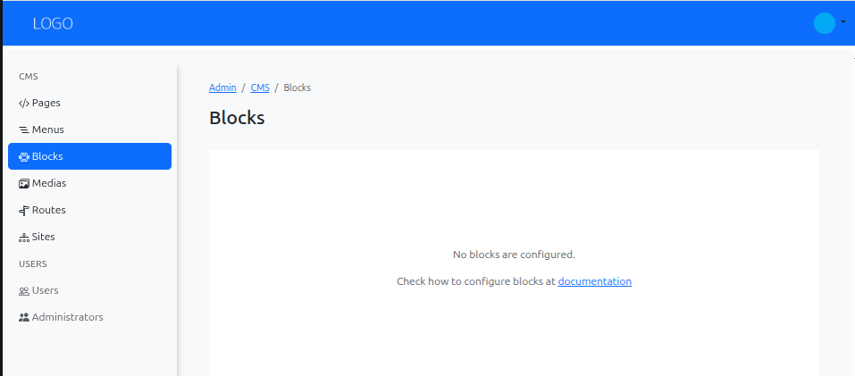
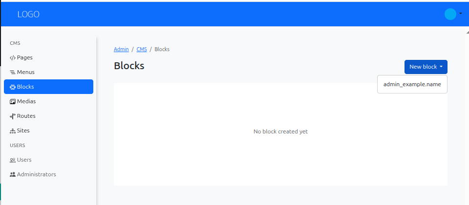
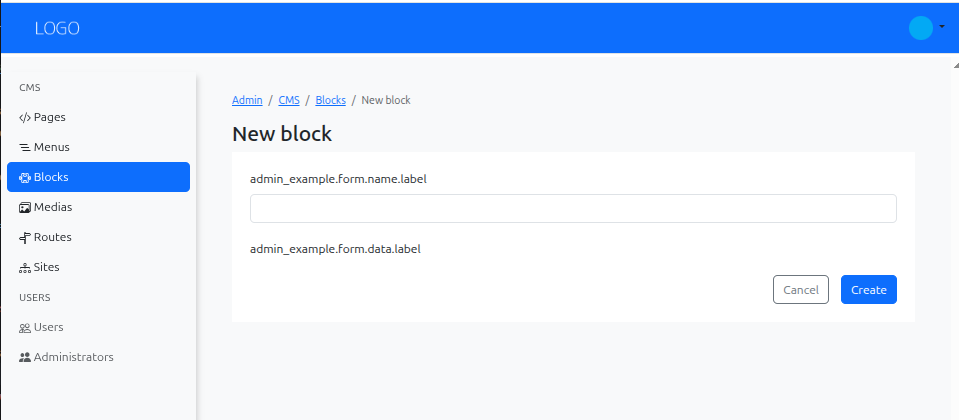
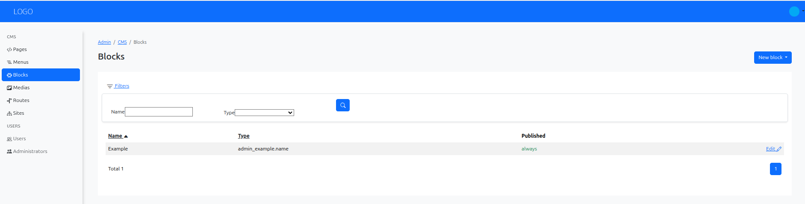

# Creating a New Block in Armonic CMS

This user manual will guide you step by step through the process of creating a new block in the Armonic CMS administration panel.

## Accessing the Block Creator {#accessing-the-block-creator}
Navigate to the Armonic CMS administration panel.
In the **left sidebar**, locate the **CMS/Blocks** section.

{.img-fluid}

First, you can see that you don't have any blocks configured yet.
To configure block types, see the [Block Configuration (cms blocks)](../configuration/configure-blocks.md) section.

Once you have configured a block (in our example, the ‘example’ block), look for the **‘New block’ button** in the top-right corner of the ‘Blocks’ section.

{.img-fluid}

Choose the type of block you want to create from the dropdown menu. The available block types will depend on the modules installed in your Armonic CMS instance.

## Filling Basic Information {#filling-block-basic-information}

Complete the basic fields or the custom fields for the block type you selected. 

{.img-fluid}

## Save, view and edit the block {#save-view-edit-block}

After filling in the necessary information, click the **‘Save’ button** to create the block.
Once saved, you can view the block details, edit its content, or delete it if needed.

{.img-fluid}

## Using the Block in Pages {#using-block-in-pages}

Creating a block does not automatically place it in a page layout.
To render it in a page, add it in a module/block slot from the page editor.

See [Adding modules or blocks](adding-modules-or-blocks.md) for the full workflow.
