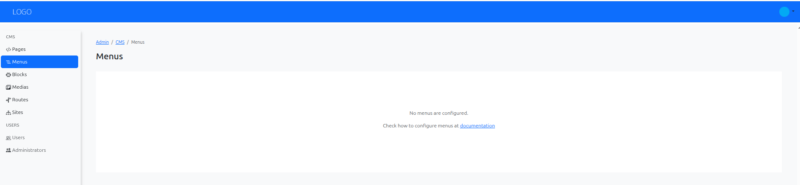
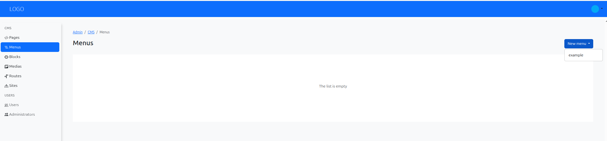
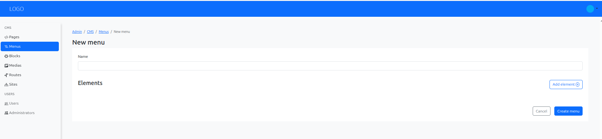
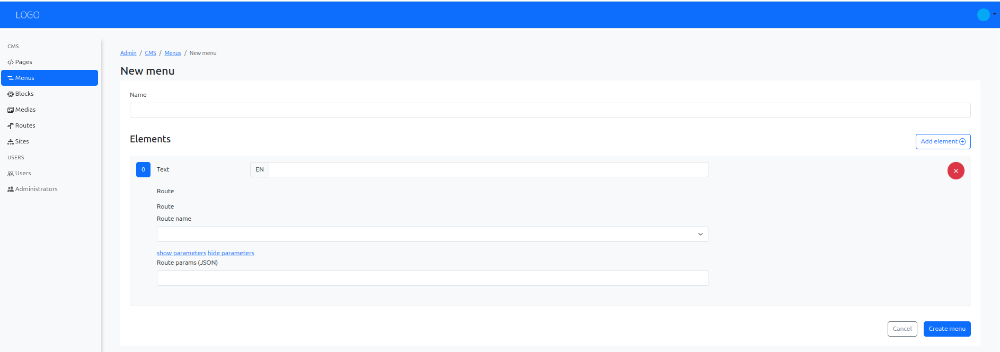
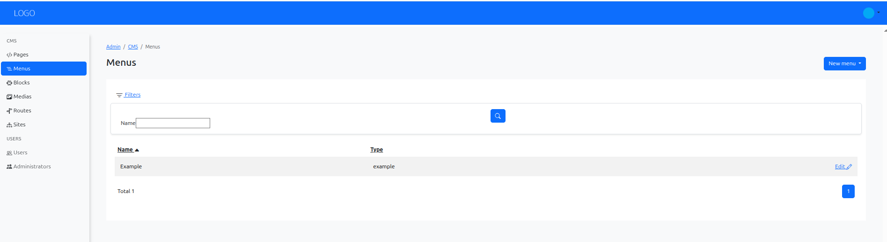

# Creating a New Menu in Armonic CMS

This user manual will guide you step by step through the process of creating a new menu in the Armonic CMS administration panel.

## Accessing the Menu Creator {#accessing-the-menu-creator}
Navigate to the Armonic CMS administration panel.
In the **left sidebar**, locate the **CMS/Menus** section.

{.img-fluid}

First, you can see that you don't have any menus configured yet.
To configure menu types, see the [Menu Configuration (cms menus)](../configuration/configure-menu.md) section.

Once you have configured a menu (in our example, the ‘main’ menu), look for the **‘New menu’ button** in the top-right corner of the ‘Menus’ section.

{.img-fluid}

Choose the type of menu you want to create from the dropdown menu. The available menu types will depend on the modules installed in your Armonic CMS instance.

## Filling Basic Information {#filling-menu-basic-information}

Complete the basic fields or the custom fields for the menu type you selected.

{.img-fluid}

You can add elements to the menu by clicking the **‘Add element’ button**. Each element can have a basic field.

{.img-fluid}

## Save, view and edit the menu {#save-view-edit-menu}

After filling in the necessary information, click the **‘Save’ button** to create the menu.
Once saved, you can view the menu details, edit its content, or delete it if needed

{.img-fluid}

## Using the Menu in Pages {#using-menu-in-pages}

Creating a menu does not automatically place it in a page layout.
To render it in a page, add it in a module/menu slot from the page editor.
See [Adding modules or blocks](adding-modules-or-blocks.md) for the full workflow.