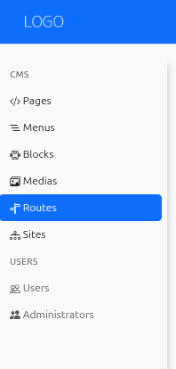
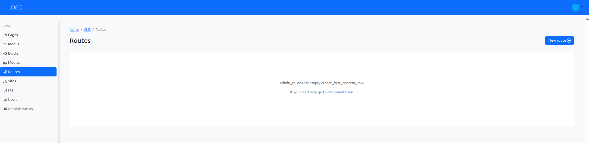
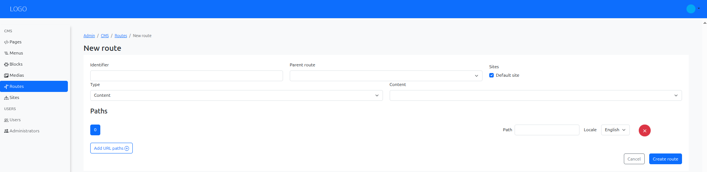
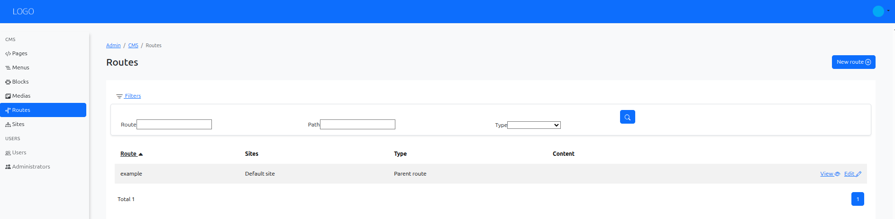

# Create Routes in Armonic CMS

In Armonic CMS, routes are essential for defining how your website's URLs are structured and how they connect to the content and controllers that manage the display of your pages. This section will guide you through the process of creating routes in Armonic CMS.

## Accessing the Routes Section {#accessing-routes-section}

Navigate to the Armonic CMS administration panel.
In the **left sidebar**, locate the **CMS/Routes** section.

{.img-fluid}

## Creating a New Route {#creating-new-route}

To create a new route, click on the **‘New Route’ button** located in the top right corner of the Routes section.

{.img-fluid}

## Filling Route Information {#filling-route-information}

Once you click on the New Route button, a form will appear to define the route details.

{.img-fluid}

## Save, view and edit the route {#save-view-edit-route}

After filling in the necessary information, click the **‘Save’ button** to create the route.
Once saved, you can view the route details, edit its content, or delete it if needed.

{.img-fluid}
